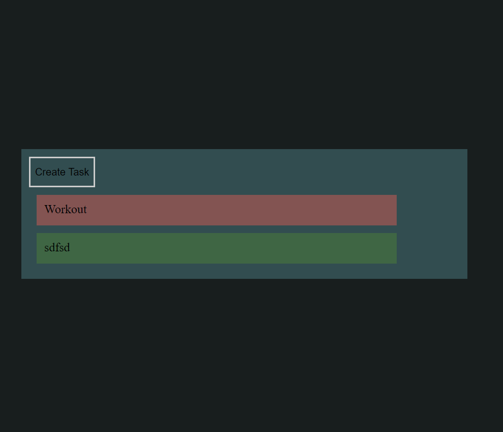

# Tasker With Timer:
Add task to the list with the limited time. Shows red colored card if time exceeds.

## Deployed link
* [TimerTask](https://timer-task-87fbe.web.app/)

## Built With
* [React](https://reactjs.org/)
* [SCSS](https://sass-lang.com/)
* [HTML5 & CSS3](https://www.w3.org/)
* [JavaScript]()

## Running locally
In the project directory, you can run:
### `npm start`
Runs the app in the development mode.\
Open [http://localhost:3000](http://localhost:3000) to view it in the browser.

### `npm run build`
Builds the app for production to the `build` folder.\
It correctly bundles React in production mode and optimizes the build for the best performance.
